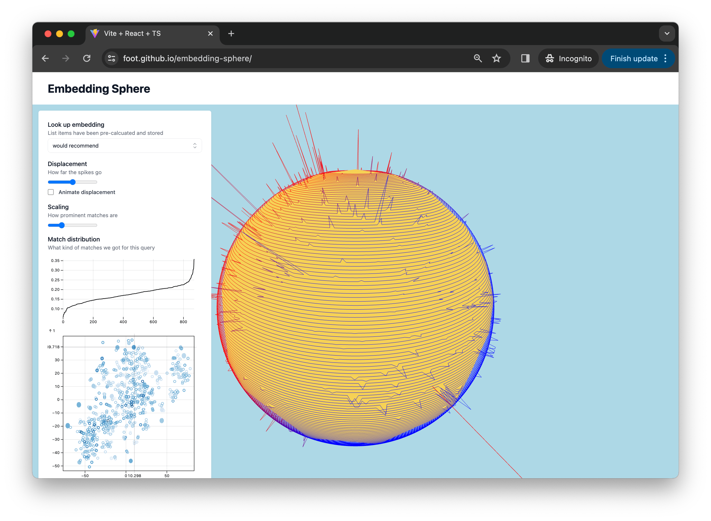

# embedding-sphere

An experiment in visualizing embeddings on the surface of a sphere.

While discussing [a past experiment on visualizing population data on a sphere's surface](https://github.com/foot/globen-three) with another LLM enthusiast, they wondered whether this approach could be adapted for visualizing embeddings. Here we are.

Demo: https://foot.github.io/embedding-sphere/



## Running locally

```
pnpm install
VITE_OPENAI_API_KEY=$OPENAI_API_KEY pnpm run dev
```

Optionally provide `VITE_OPENAI_API_KEY` to lookup embeddings of queries in the browser and see how they match the embedding dataset.

## Whats going on

Not too much new, we start off from [OpenAI's _Visualizing the embeddings in 2D_ notebook](https://github.com/openai/openai-cookbook/blob/main/examples/Visualizing_embeddings_in_2D.ipynb). It takes the classic _fine food reviews_ dataset and plots the embeddings in 2D.

We do this here in `generate_2d_embeddings.py` and write the layout to JSON. Then we load all the 1000 embeddings and tSNE layout data into the browser and play around with rendering it.

You can then lookup the embeddings of given query, the similarity of the query to the dataset is shown on the sphere.

## Ideas to explore

### Mapping high (1538) dimensional embeddings to 2D spherical surface

Here we're using t-SNE ("t-distributed Stochastic Neighbourhood Embedding") to map high dimensional embeddings to 2D spherical surface. Ideally similar embeddings should be mapped to similar locations on the 2D spherical surface.

This initial implementation first maps to "cartesian" coordinates (euclidean distance fn) and then projects to spherical coordinates. This unfortunately means that the points that are supposed to be furthest apart are displayed next to each other as we "wrap" our 2D plot around the sphere.

- Can we adapt the t-SNE algorithm to map to spherical coordinates directly (use haversine or something as the distance fn)? Initial conversations w/ ChatGPT suggests that it's not as simple as changing a distance fn somewhere..
- Project to 3D space and then project to the 2d surface of sphere somehow? e.g. do the final dimension reduction using some other technique.. somehow..?
- Do the [t-SNE in the browser](https://distill.pub/2016/misread-tsne/) to explore all this stuff?
- Pre-process w/ PCA ("Principal Component analysis") first?

### Switch up the visualization

In this viz we have rounded the data points to the nearest "lat, lng", in the sample data set (1000 reviews), we're only ever showing ~900 or so, as they collide when they're close together and we just take the last one.

- Drop the lines-based viz method and switch to points? Build a mesh?

### Write a BE

We need to load in 35mb of JSON which is mostly big old embeddings.
